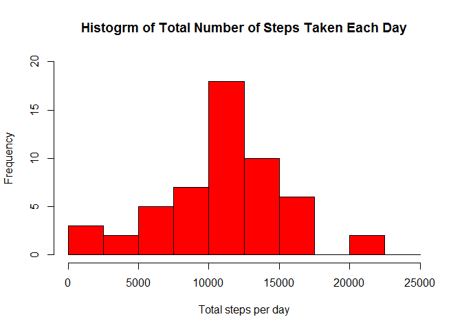
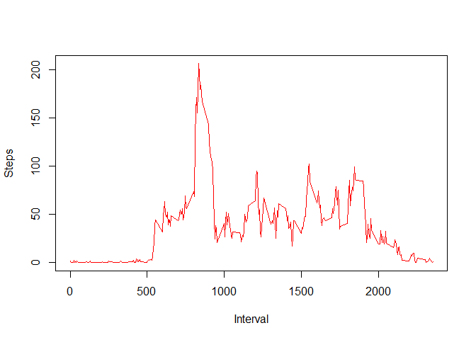
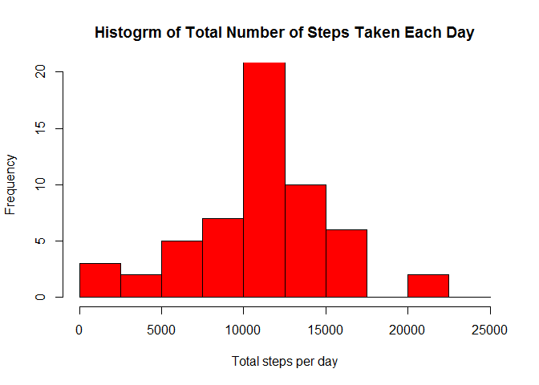
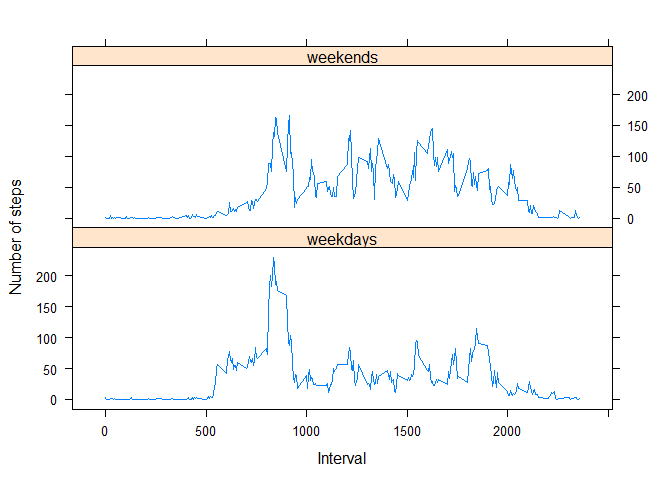

# Reproducible Research: Peer Assessment 1


## Loading and preprocessing the data

### 1. Loading the data and check what the status


```r
activity <- read.csv('activity.csv')
head(activity)
```

```
##   steps       date interval
## 1    NA 2012-10-01        0
## 2    NA 2012-10-01        5
## 3    NA 2012-10-01       10
## 4    NA 2012-10-01       15
## 5    NA 2012-10-01       20
## 6    NA 2012-10-01       25
```


```r
str(activity)
```

```
## 'data.frame':	17568 obs. of  3 variables:
##  $ steps   : int  NA NA NA NA NA NA NA NA NA NA ...
##  $ date    : Factor w/ 61 levels "2012-10-01","2012-10-02",..: 1 1 1 1 1 1 1 1 1 1 ...
##  $ interval: int  0 5 10 15 20 25 30 35 40 45 ...
```


### 2. Loading the dplyr package 

```r
library(dplyr)
```

### 3. Process/transform the data (if necessary) into a format suitable for your analysis

```r
dailysteptotal <-activity %>% group_by(date) %>% summarise(steps = sum(steps))
```


## What is mean total number of steps taken per day?

### 1. Calculate the total number of steps taken per day

```r
dailysteptotal <-activity %>% group_by(date) %>% summarise(steps = sum(steps))
head(dailysteptotal)
```

```
## # A tibble: 6 x 2
##         date steps
##       <fctr> <int>
## 1 2012-10-01    NA
## 2 2012-10-02   126
## 3 2012-10-03 11352
## 4 2012-10-04 12116
## 5 2012-10-05 13294
## 6 2012-10-06 15420
```

### 2. Make a histogram using base plotting system

```r
hist(dailysteptotal$steps,breaks = seq(0,25000,by = 2500),ylim = range(0,20,5),main = "Histogrm of Total Number of Steps Taken Each Day",xlab ="Total steps per day", col = "red")
```

<!-- -->

### 3. Calculate and report the mean and median of the total number of steps taken per day

```r
meanD <- mean(dailysteptotal$steps,na.rm = T)
medianD <-median(dailysteptotal$steps,na.rm = T)
meanD
```

```
## [1] 10766.19
```

```r
medianD
```

```
## [1] 10765
```

### Answer: The mean and median of the total number of steps taken per day is 1.0766189\times 10^{4} and 10765.


## What is the average daily activity pattern?

### 1.Make a time series plot (i.e. type = "l") of the 5-minute interval (x-axis) and the average number of steps taken, averaged across all days (y-axis)

```r
dailystepavg <-activity %>% group_by(interval) %>% summarise(steps = mean(steps,na.rm = T))
plot(x=dailystepavg$interval,y=dailystepavg$steps,type = "l",col="red",xlab = "Interval", ylab = "Steps")
```

<!-- -->

### 2. Calculate Which 5-minute interval, on average across all the days in the dataset, contains the maximum number of steps

```r
maxintervalstep <- subset(dailystepavg, steps == max(dailystepavg$steps))
a <- maxintervalstep$interval
```

### Answer: Interval at 835 minutes contains the maximum number of steps.

## Imputing missing values

### 1. Calculate and report the total number of missing values in the dataset (i.e. the total number of rows with NAs)


```r
missing <-sum(is.na(activity))
```

The total number of missing values is 2304.

### 2. Devise a strategy for filling in all of the missing values in the dataset. Create a new dataset that is equal to the original dataset but with the missing data filled in.


```r
newact <- activity
for (i in 1:nrow(newact)) {
    if (is.na(newact$steps[i])) {
        newact$steps[i] <-  dailystepavg[which(newact$interval[i] == dailystepavg$interval), ]$steps
    }
}

head(newact)
```

```
##       steps       date interval
## 1 1.7169811 2012-10-01        0
## 2 0.3396226 2012-10-01        5
## 3 0.1320755 2012-10-01       10
## 4 0.1509434 2012-10-01       15
## 5 0.0754717 2012-10-01       20
## 6 2.0943396 2012-10-01       25
```

```r
sum(is.na(newact))
```

```
## [1] 0
```

### 3.Make a histogram of the total number of steps taken each day and Calculate and report the mean and median total number of steps taken per day.


```r
NewstepT <-newact %>% group_by(date) %>% summarise(steps = sum(steps))

hist(NewstepT$steps,breaks = seq(0,25000,by = 2500),ylim = range(0,20,5),main = "Histogrm of Total Number of Steps Taken Each Day",xlab ="Total steps per day", col = "red")
```

<!-- -->


```r
newmeanD <- mean(NewstepT$steps)
newmedianD <- median(NewstepT$steps)

newmeanD
```

```
## [1] 10766.19
```

```r
newmedianD
```

```
## [1] 10766.19
```

### These formulas gives a mean and median of 1.0766189\times 10^{4} and 1.0766189\times 10^{4} respectively. The mean number is same but the median has a little change. Overall, there is no big impact on the analysis of data.


## Are there differences in activity patterns between weekdays and weekends?

### 1. Create a new factor variable in the dataset with two levels – “weekday” and “weekend” indicating whether a given date is a weekday or weekend day.

```r
newact$date <-as.Date(newact$date,"%Y-%m-%d")
newact$weekday <-weekdays(newact$date)
newact$dayType <- ifelse(newact$weekday %in% c("Saturday","Sunday"), "weekends","weekdays")
head(newact)
```

```
##       steps       date interval weekday  dayType
## 1 1.7169811 2012-10-01        0  Monday weekdays
## 2 0.3396226 2012-10-01        5  Monday weekdays
## 3 0.1320755 2012-10-01       10  Monday weekdays
## 4 0.1509434 2012-10-01       15  Monday weekdays
## 5 0.0754717 2012-10-01       20  Monday weekdays
## 6 2.0943396 2012-10-01       25  Monday weekdays
```

### 2. Make a panel plot containing a time series plot (i.e. type = "l") of the 5-minute interval (x-axis) and the average number of steps taken, averaged across all weekday days or weekend days (y-axis). See the README file in the GitHub repository to see an example of what this plot should look like using simulated data.

```r
newstepavg <- aggregate(steps ~ interval + dayType, data=newact, mean)

head(newstepavg)
```

```
##   interval  dayType      steps
## 1        0 weekdays 2.25115304
## 2        5 weekdays 0.44528302
## 3       10 weekdays 0.17316562
## 4       15 weekdays 0.19790356
## 5       20 weekdays 0.09895178
## 6       25 weekdays 1.59035639
```


```r
library(lattice)

xyplot(steps ~interval | dayType, newstepavg,type = "l",layout = c(1,2),xlab="Interval", ylab = "Number of steps")
```

<!-- -->


